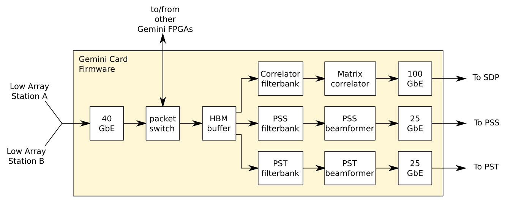

.. vim: syntax=rst

Low CBF Firmware
================

Low CBF firmware consists of VHDL source code implementing filters, correlators
and beamformers required for Low CBF, shown in highly simplified form in the
following diagram

Hardware Platform
-----------------

Low CBF firmware
is intended to run on a Gemini Card which is based on a Xilinx XCVU37P FPGA. 
The Gemini card has several high-speed optical interfaces:

- 10GbE Monitoring and Control channel. The control plane of the Gemini card
  consists of 32-bit registers accessed via a UDP/IP based protocol
  (`Gemini Protocol <https://confluence.skatelescope.org/display/SE/Gemini+Protocol+in+brief>`_)
- 40GbE to receive digitised station data from the Low Array. Each station will
  send complex 8-bit dual-polarisation data for up to 384 Coarse Frequency
  channels. Channel centre frequencies will be spaced by 781.25 kHz but channel
  data will be  over-sampled 32/27 i.e. have a sample period of 1080 nsec.
  With FPGAs receiving data from two
  stations, the data rate over the 40G link will be up to 23Gbps. 
- 100GbE output to SDP (visibilities)
- 25GbE output to PSS
- 25GbE output to PST

A key feature of the FPGA is its High Bandwidth Memory (HBM).
The HBM allows station data to be re-ordered for correlation. Station data is
received as a time-based data stream and stored in the HBM. When a complete
integration period is held in the HBM it is read out by frequency channel and
a cross-correlation is performed for each frequency channel.
Because the HBM is part of the FPGA rather
than an external DIMM there is no need for power-hungry memory bus interfaces.

Firmware Design
---------------

Firmware capabilities will be developed in a number of increments

- AA0.5: 6 Stations, 3 Gemini Cards
- AA1: 24 Stations, 12 Gemini Cards
- AA2: 288 Stations, 144 Gemini Cards
- AA3: 512 Stations, 288 Gemini Cards (Full correlator, no PSS & PST)
- AA4: 512 Stations, 288 Gemini Cards (Full correlator, PSS & PST)

Design of the firmware blocks is described in detail `here <https://confluence.skatelescope.org/display/SE/PISA+FPGA+Module+Descriptions>`_.

Building Firmware
-----------------

RadioHDL is a software tool included in the repository that automates building
registers in the firmware design and creating a Project File so that
`Xilinx Vivado HLx <https://www.xilinx.com/products/design-tools/vivado.html>`_ can compile
the firmware to a bit file that can be loaded into and run on the FPGA. The process to `use RadioHDL to build code <https://confluence.skatelescope.org/display/SE/howto%3A+First-time+build+on+giant.atnf.csiro.au>`_ is described on
SKA Confluence.

Vivado is licensed software. Some of the IP included in the design, such as
the high-speed optical interfaces, is also licensed software.
